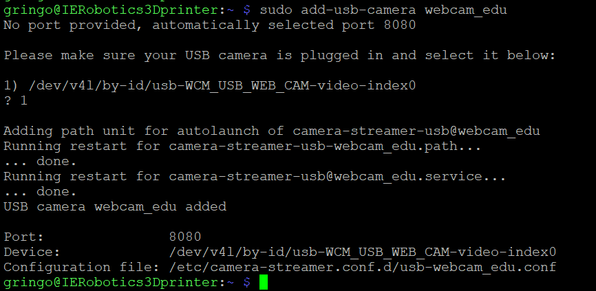

# Octoprint Instructions for Raspberry Pi
Instructions to replicate and use the raspberry pi with octoprint image to 3D print models remotely.

Check Videos Demo and Images for more help.

by [Gregorio Orlando](https://github.com/GRINGOLOCO7)
 <br>

<div align="center">
  
</div>

# Table of Contents

1. [Introduction](#introduction)
2. [Connect 2 Cameras](#connect-2-cameras)
3. [Connect 2 3D Printers](#connect-2-3d-printers)
4. [How to Do a Good Slice](#how-to-do-a-good-slice)
5. [Usage](#usage)
6. [Plugins](#pluggins)
7. [Printers Mantainence](#printer-mantainence)
8. [Attention](#attention)

# Introduction

In this project, we are enhancing the functionality of the 3D printers in the lab.

Using a **Raspberry pi**, we installed the **Octoprint** image in it and we are now able to controll 2 3D printers remotely. Moreover whe have 2 webcams for each printer, we cna
<br>

# Connect 2 cameras
Resources:
- https://www.youtube.com/watch?v=n9smmmH1O7Y
- https://community.octoprint.org/t/camera-streamer-configuration-on-the-new-camera-stack-for-octopi/49950
- https://hatoum.com/blog/2020/5/27/install-both-a-raspberry-pi-camera-and-a-usb-camera-on-octopi-017

1. **See what cams you have: Go to config files of default**
```
ls /boot/camera-streamer/
```
2. **See attribute on one cam:**
```
cat /boot/camera-streamer/usb-default
```
config
Default cam is in port 8080

3. **Check on this camera:**
```
sudo systemctl status camera-streamer
```
See that stream is up
```
ps -aux | grep camera
```

4. **Remove default config files and add my cams**:
```
sudo remove-usb-camera default
```
-> no longer cam on 8080
```
rm /boot/camera-streamer libcam
```
remove raspberry cam file

5. **Plug in camera:**
```
sudo add-usb-camera <name> <port>
```


<small><i>We added a default camera to webcams. We called it "webcam_edu" and automatically set it to port 8080, which is the first available.</i></small>

6. **Check first camera**:


<small><i>To do so we go to our AP address and see if the default camera pops out. We are using the "Classic Webcam" plugin for now.</i></small>

7. **Add second webcam:** Plug in the second camera and do the same comand as before:
```
sudo add-usb-camera <name> <port>
```
Automaticly it will addres the second webcam to the next port avaible. (because 8080 is the first, this one will be 8081)


8. **Modify the config files just created**:
> In both files substitute YUYV with MJPEG

> In the cam in port 8081 add next to option this line to listen all the interfaces: OPTIONS='--http-listen="0.0.0.0"'

> **In my case**, both webcams collided on under the same name in *cd /dev/v41/by-id* so I also edited the DEVICE variable to */dev/v41/by-path/path_for_video0_and_video2* (to find the path for video0 and video2 just type *ls -l /dev/v41/by-path*)


9. **View both webcams**: Now if you go on a new page and search for
> http://<AP_address>/webcam/?action=stream -> to see default one (in port 8080)

> http://<AP_address>>:8081/?action=stream

10. **MultiCam pluggin**: Download Multicam Pluggin and add this 2 links to your webcams.

<br>

# Connect 2 3D printers

1. Go to Octoprint “settings”
2. Press “printers profile”
3. Press “add printer”
4. Set dimensions, name, and details of that printer

Plug in the printers with the USB cable to Raspberry pi.

We can then add a printer profile through settings in OctoPrint.

In the lab we have a Ultimaker2+ and a Witbox2.

I added both profiles, so you can switch from one to the other.

To do so, look at left part of Octoprint GUI. In *connection* chose the printer name and for the other options set AUTO.

Then connect to the printer.

<br>

# How to do a good slice

**3D printer tutorial:**
- rescue video: https://www.youtube.com/watch?v=KDDfhqc57BI&t=375s
- resource page: https://support.ultimaker.com/s/article/1667337576725

**Prepare & slice settings:**

In Cura software you can tune the settings of the printer as you prefare.

Keep in mind that in this fase you are plaing between precision of the result and time consumption to printe the entire model.
- _Layer Height_: How thin each layer => quality => approx. 0.1/0.08 (very precise)
- _Initial/Top Layer Height_: approx. 0.2 (need to be thick)

- _Speed_: slow => more precise (20mm/s)
- _Infill Speed_: can be a bit faster than speed (ex: 25 mm/s)
- _Travel Speed_: for small & fragile things low (ex: 30 mm/s)

- _Infill_: percentage of filling approx. 20%/10%

- _Line width_: the lower, the most precise, 75% of nozzle size < x < 125% of nozzle size

- _Top Bottom_: value is a multiple of nozzle (ex: nozzle = 0.4 => Top = 0.8 or 1.2)
> Note: The Nozle is the tip from where the melted material exit... the tip of the printer. To find this size you can unscrew it with a spanner and read the number on it. Usually it is 0.4mm

**Prepare .gcode:**

Once your model is ready, you can import it in Cura, tune the settings as you prefer and then save the file as a .gcode.
You are now ready to drag the file in the web page with Octoprint running.
On the left side you save the file in Octoprint, on the right side you save the file in the SD card inserted in the 3D printer (if any).
Now you can start printing.

Tune_printer_model then drag the .gcode file or press upload file in the OctoPrint interface.

<br>


# Usage:
1. Design/Download your model (Online there are sites such as [GrabCad](https://grabcad.com/library/software/nx) to Download models, or you can download for free [Fusion360](https://www.autodesk.com/campaigns/education/fusion-360) to design your own models)
1. Open [Cura](https://ultimaker.com/software/ultimaker-cura/) and on top left add the 3D printers we have in  the lab [CuraPrintersProfiles](OctoprintInstructions_raspberrypi\Images\CuraPrintersProfiles.png)
1. Import your model in Cura to slice it (slice mean tune the settings as you prefare.)
1. After slicing press _save to disk_. This will save in your computer the .gcode need for print it in Octoprint.
1. Now connect to the lab's Wi-Fi

1. Enter:
```
http://achilles
```
> (http://10.205.1.3)

to access in to the raspberry pi

2. It will ask for a username and pasword. Use the Guest account for everyone.

3. Now you can drag the .gcode file you prepared in Cura and start printing. To do so, in the left part of the graphic interface you can see the files. You will just need to press the print icon. This will start heat the printer and when the target temperature is reached it will automaticaly start print.

4. Advices:
- **If anything append just press pouse button on bottom right of interface.**
- Slice in cura tuning the settings as best.
- In Octoprint interface you can see many informations and take many actions... take a moment to play arround and understand how it works before printing.
- Add glue on the plate of the printer before priting. It will keep the object stick on the printer plate.

# Pluggins:
[resurce_gude_where_to_find_the_best_pluggins](https://all3dp.com/2/must-have-octoprint-plugins/)

- _Multicam_: It allows us to add 2 webcams and switch form one to the other.
- _UI customizer_: It allows to get rid of the orrible default GUI and design your own.
- _Dashboard_: You can see many details about your printer.
- _Cancel objects_: allows to delete a section of the printed object to avoid to print it if it brake. This allows to continue printing even if a section of the objest need to be discard, because the printer will avoid it.
- _File manager_: You can easily manage/delete/etc.. the .gcode files
- _Slicer thumbnails_: It shows what you are printing in a fancy way
- _Print time genious_: Study how much your printer move and tell you a better and accurate estimation of how much time left to respect to the default calculator
- _Octolapse_: It allows to take automatic timelapse of your printing.
- _Octoeverywhere_: It allows to monitor and connect to the printer with mobile and pc. Access with email and pw provided form lab assistent.
```
https://octoeverywhere.com
```

> when conected to octoeverywhere, the webcams won't be avaible, but you can type: `https://ultimaker.octoeverywhere.com/webcam/?action=stream` to see ultimaker webcam

# Printer Mantainence
It is a good practice to clean the printer before and after the use.
To do so you can follow this steps:
1. spray with alchol or any cleaning product on the printer plate and clean the glue/remining sign from previous prints.
2. use the brass wire brush in the 3D printer kit to clean the nozle from residual material
3. in the 3D printer kit you can also find a long needle that can be inserted in the nozle to check if some material is stuck inside.
<br>

# !!Attention!!

1. printing without monitoring is really dangerous. it is always adviced to check the printer in person and avoid leave it without supervision.

2. MANTAIN THE PRINTER IN GOOD STATUS!! TAKE CARE, CLEAN AND DON'T SWITCH THEM OFF.

3. The printer is not reliable. If you start printing monitor the object to check if everithing is working fine. Usually the object detach from the plate and start melting in the nozle.

4. Make confidence with the Graphic Interface of octoprint before printing. Understand that the direction arrow works in oppisite way as you may expect.

5. Identify the 'stop' and 'pause' buttons on bottom right of GUI.

6. Do not start printing from home. Start the printing in school, so you can apply the glue on the plate before printing and monitorize in person the first stage of the print... the most delicate.


